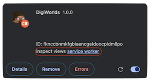

# Digi Worlds

## Chromium extension

- Bootstrapped w `npm create vite@latest`

Dev starter:

1. `npm run build` will create [./dist](./dist) (see [vite.config.ts](./vite.config.ts))
2. Open your Chromium browser's [extensions](chrome://extensions/)
3. Click <kbd>Load unpacked</kbd> and choose[./dist](./dist)

- From here, the feedback loop is: `npm run build` + 
- DX tip: `npm run dev` to edit popup's UI faster (but note any handlers using the _chrome_ obj will sh1t itself)

To view console logs:

- ⚛️ component logs? inspect the extension's pop-up
- 💉 Injected scripts logs? inspect current page (e.g., `chrome.scripting.executeScript()`)
- 🤖 Service worker logs? inspect the [extension](chrome://extensions/):

  
