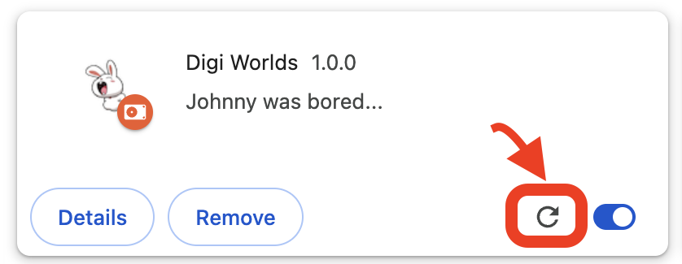
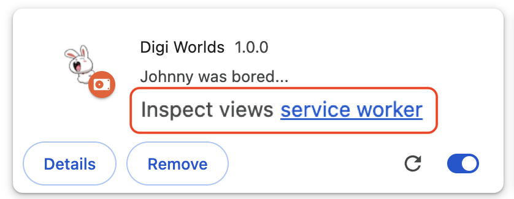

# BRO PLEASE, FILL MY FORMS

A Chromium Extension (CRX) that uses a single text box to **auto-fill** any form based on **natural** language (pro-tip: use **dictation**! 🎙️)

## 📋 How do I use it?
1. BYO keys; generate your own Google Gemini API Key [here](https://aistudio.google.com/apikey) (free quota)
2. Find any site with forms
3. Open the popup and follow the tutorial for the first time

## 🔌 How do I run it?
### 🏪 Chrome Web Store:
1. Get it [here](TODO:)

### 🧑‍💻 Manually:
1. `npm run build` will dump the artifact [here](./bro-please-fill-my-forms/dist)
2. Open your browser's extensions (for example: [chrome://extensions/](chrome://extensions/))
3. Click <kbd>Load unpacked</kbd> and choose the artifact directory
4. Make changes and repeat: `npm run build` + reload 

## 🏎️ How do I edit the popup *FAST*?
1. `npm run dev` to edit the popup like a normal web app (faster feedback loop)
2. FYI because we're not running as an extension, the app is unable to access chrome.storage.* and ∴ sh!t itself. To combat this, the chrome storage services will check if we're in development mode and mock all storage CRUD ops as successful. `npm run dev` = development mode, `npm run build` = production mode.
3. During development, use the debug menu (bottom-left corner) or shortcut <kbd>⌃1</kbd> to console log the state from all Zustand stores
4. Before deploying to PROD, `cp .env.example .env` and set **VITE_HIDE_DEBUG_LOGS** = **true**

## 🪵 How do I view the console logs?
- ⚛️ Component logs? inspect the popup UI
- 🤖 Service worker logs? inspect the extension 
- 💉 Injected scripts logs (`chrome.scripting.executeScript`)? inspect the current page

## ⚡️ How do I optimize the bundle size?
- After a build: `open stats.html`
- Inspect problematic chunks in CRX's bundle
- Lazy-load/etc to reduce the bundle size (improve initial load times)
