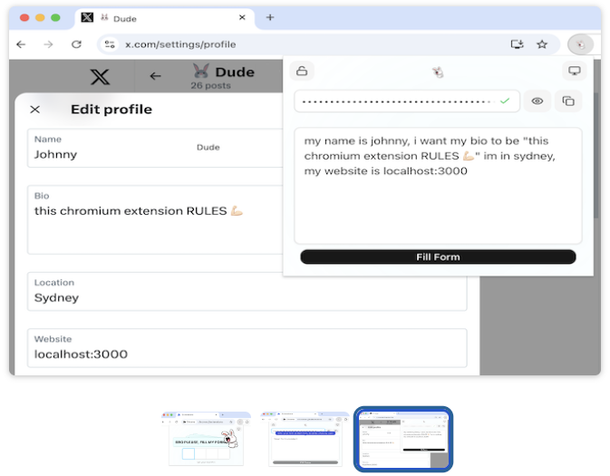
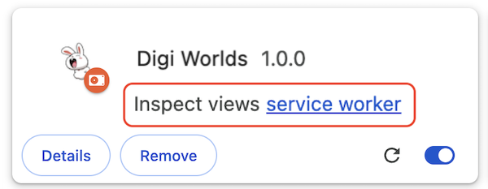

# BRO PLEASE, FILL MY FORMS

_"Finally, a Single Text Box that Fills All My Forms!"_

Chromium Extension (CRX) that **auto-fill** any form using **natural** language (pro-tip: use dictation 🎙️)

## 📋 How do I use it?
1. BYO keys: generate your own Google Gemini API Key [here](https://aistudio.google.com/apikey) (generous free quota)
2. Find any site with a form
3. Open the popup and follow the tutorial

## 🔌 How do I run it?
### 🏪 Chrome Web Store:
Get it [here](https://chromewebstore.google.com/detail/bro-please-fill-my-forms/cginpdgbbfjkanihacmoiggbneiliabf)!

### 🧑‍💻 Manually:
1. `npm run build` will dump the artifact [here](./bro-please-fill-my-forms/dist)
2. Open your browser's extensions (for example: [chrome://extensions/](chrome://extensions/))
3. Click <kbd>Load unpacked</kbd> and choose the artifact directory
4. Make changes and repeat: `npm run build`

## 🏎️ How do I edit the popup *FAST*?
1. `npm run dev` to edit the popup like a normal web app (faster feedback loop)
2. FYI because we're not running as an extension, the app is unable to access chrome.storage.* and will sh!t itself. To combat this, the chrome storage services will check if we're in development and mock all storage CRUD ops as successful. Reminder `npm run dev` = DEV, `npm run build` = PROD.
3. During development, use the debug menu (bottom-left corner) or shortcut <kbd>⌃1</kbd> to console log state from all Zustand stores

## 🪵 How do I view the console logs?
- ⚛️ Component logs? inspect the popup UI
- 🤖 Service worker logs? inspect the extension
  
  
- 💉 Injected scripts logs (`chrome.scripting.executeScript`)? inspect the current page

## ⚡️ How do I optimize the bundle size?
- After a build: `open stats.html`
- Inspect problematic chunks in CRX's bundle
- Lazy-load/etc to reduce the bundle size (improve initial load times)
